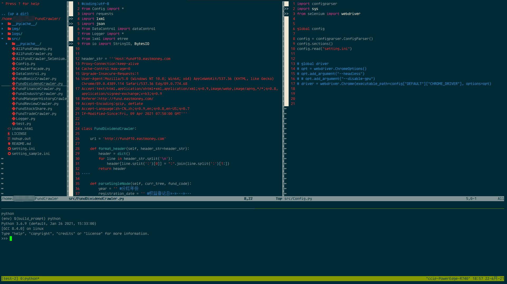
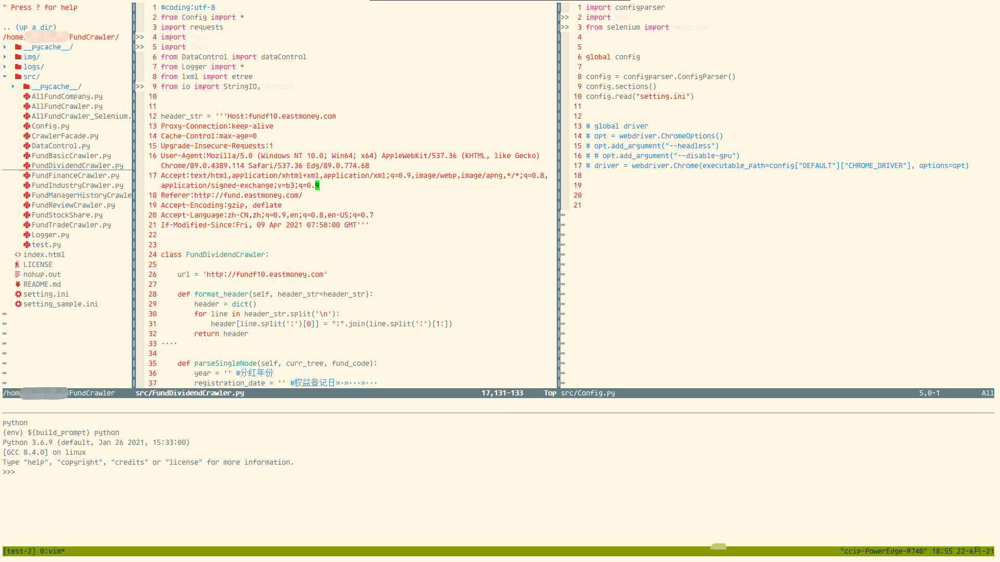

# 配置vim 将vim打造成一个轻量的IDE

## 预览

#### 添加功能：
- 文件管理：插件NerdTree
- 跳转功能：Ctags
- 任意跳转功能，主要是和前一个功能进行补充；JumpAny
- 搜索功能：LeaderF
- 代码补全：Coc.nvim
- 代码错误修正：Coc.nvim
- 单终端编译和写代码，不用Crtl-z切后台编译，直接借助tmux和vimux插件实现在一个界面写代码和编译
- 更加强大的终端zsh和on-my-zsh管理 

## linux安装
#### tmux安装
```bash
sudo apt install libevent ncurses
sudo apt install tmux
# 配置tmux支持快捷键与vim无缝切换
if [ ! -e "~/.tmux.conf" ]; then
    touch ~/.tmux.conf
fi 
cat>>~/.tmux.conf<<-"eof"
# VIM模式
bind-key k select-pane -U # up
bind-key j select-pane -D # down
bind-key h select-pane -L # left
bind-key l select-pane -R # right
#开启鼠标
set -g mouse on
eof
```
#### zsh安装
```bash
sudo apt install zsh
#安装oh-my-zsh
option 1
sh -c "$(wget -O- https://raw.githubusercontent.com/ohmyzsh/ohmyzsh/master/tools/install.sh)"
# option 2
git clone git@github.com:ohmyzsh/ohmyzsh.git
cd ohmyzsh/tools
vim install.sh
#修改为ssh git
./install.sh
#install theme
sed -i 's#"robbyrussell"#"agnoster"#g' ~/.zshrc
#激活环境bash变量
echo 'source ~/.bash_profile'>>~/.zshrc
```
#### 安装autojump
```zsh
git clone git://github.com/joelthelion/autojump.git
cd autojump
./install.py
cat>>~/.zshrc<<-"eof"
[[ -s /home/laixinhua/.autojump/etc/profile.d/autojump.sh ]] && source /home/laixinhua/.autojump/etc/profile.d/autojump.sh
autoload -U compinit && compinit -u
eof

```
#### 编译python3.8.8
```bash
#Ubuntu
sudo apt install -y zlib1g zlib1g-dev libffi-dev openssl libssl-dev
wget https://www.python.org/ftp/python/3.8.8/Python-3.8.8.tar.xz
tar -xvf Python-3.8.8.tar.xz
cd Python-3.8.8.tar.xz
./configure --enable-shared --enable-optimizations --prefix=/usr/local/python3.8
make altinstall -j8
sudo make install
# add bin path
echo 'export PATH=/usr/local/python3.8/bin:$PATH'>>~/.bash_profile
```
#### 编译vim 支持Python和clipboard
```bash
git clone https://github.com/vim/vim
cd vim
git pull && git fetch
export LD_FLAGS="-rdynamic"
./configure --enable-multibyte
--enable-python3interp=dynamic --with-python3-config-dir=/usr/local/python3.8/lib/python3.8/config-3.8-x86_64-linux-gnu --enable-cscope --enable-gui=auto --with-features=huge --with-x --enable-fontset --enable-largefile --disable-netbeans --with-compiledby=SivanLaai --enable-fail-if-missing
make && sudo make install
```
```bash
cp -rf vimrc ~/.vimrc
```
# 编译nodejs,插件coc需要nodejs的功能
# 安装nodejs, 插件coc.vim会用到这个软件
```bash
wget https://nodejs.org/dist/v14.17.1/node-v14.17.1-linux-x64.tar.xz
tar -xvf node-v14.17.1-linux-x64.tar.xz
echo "installing nodejs"
sudo mv node-v14.17.1-linux-x64 /usr/local/nodejs 
```
#添加nodejs环境变量
```bash
bash_file="~/.bash_profile"
echo ${bash_file}
if [ ! -e "~/.bash_profile" ]; then
    touch ~/.bash_profile
fi 
cat>>~/.bash_profile<<-"eof"
#config nodejs env path
VERSION=v14.17.1
DISTRO=linux-x64
export PATH=/usr/local/nodejs/bin:$PATH
eof
```
```bash
#安装ctags，主要用来索引
#安装依赖
sudo apt install \
    gcc make \
    pkg-config autoconf automake \
    python3-docutils \
    libseccomp-dev \
    libjansson-dev \
    libyaml-dev \
git clone https://github.com/universal-ctags/ctags.git
cd ctags
./autogen.sh
./configure --prefix=/usr/local # defaults to /usr/local
make -j8
sudo make install 
cd ..
rm -rf ctags
```
## 安装vim-plug
```bash
# 安装vim-plug
#curl -fLo ~/.vim/autoload/plug.vim --create-dirs \
#    https://raw.githubusercontent.com/junegunn/vim-plug/master/plug.vim
git clone git@github.com:junegunn/vim-plug.git
# 如果安装失败的话，可能就需要修改plug.vim
find ~ -name 'plug.vim' | xargs perl -pi -e 's|https://git::@github.com/%s.git|git@github.com:%s.git|g'
cp -rf ./vim-plug/plug.vim ~/.vim/autoload/plug.vim
## 打开vim
vim
:PlugInstall #等待插件安装完成
####配置coc
:CocInstall coc-json coc-tsserver
:CocInstall coc-pyright coc-clangd coc-snippets
```

## gvim
#### 安装
```
下载python编译版本gvim：https://github.com/vim/vim-win32-installer/releases
安装相关的python
下载安装字体 DejaVu Sans Mono for Powerline
https://github.com/powerline/fonts/blob/master/DejaVuSansMono/DejaVu%20Sans%20Mono%20for%20Powerline.ttf
```
#### 复制配置文件
```
cp -rf gvim/_vimrc $vim/_vimrc
cp -rf gvim/autoload vimfile
cp -rf gvim/colors vimfile #Solarized Dark 主题复制
```
#### 配置gvim
```
:PlugInstall #待安装完成
```
## Xshell 护眼主题 Eyes Protection
##### 安装方式
在Xshell 配色方案里导入 本项目中的xcs文件
#### Solarized Dark

#### Solarized Light

